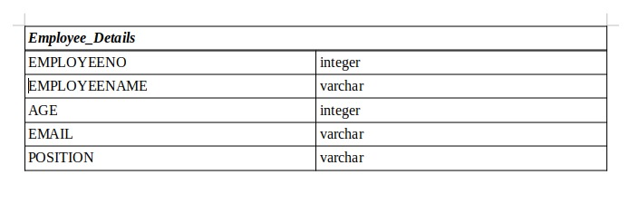
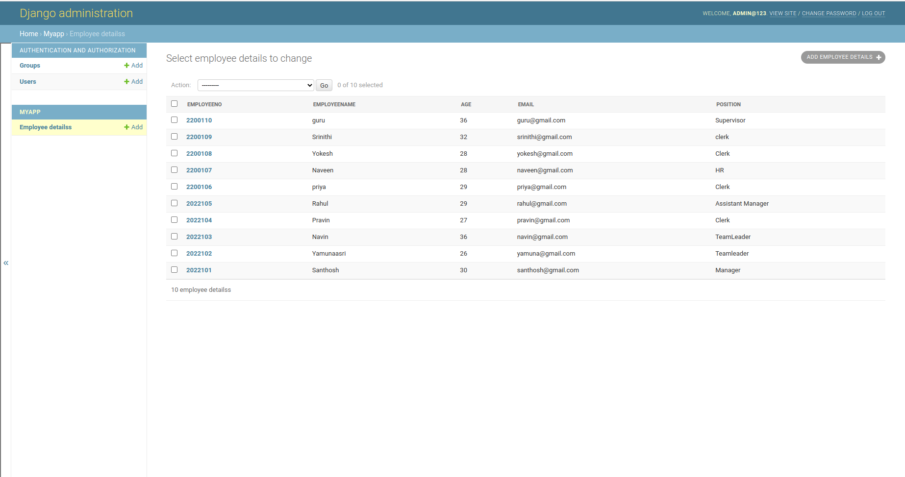
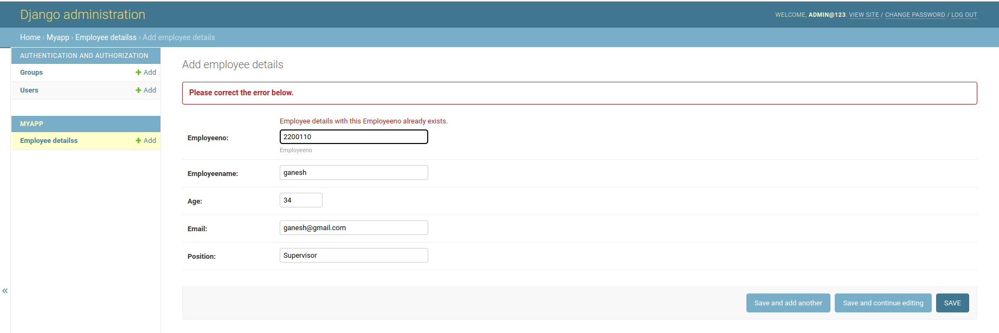

# Django ORM Web Application

## AIM
To develop a Django application to store and retrieve data from a database using Object Relational Mapping(ORM).

## Entity Relationship Diagram

ER diagram



## DESIGN STEPS

### STEP 1: 
Create a new Django project using "django-admin startproject", get into the project
terminal and use "python3 manage.py startapp"command.

### STEP 2:

Define a model for the students_marks in the models.py. Allow host access and add
the app name under installed apps in settings.py

### STEP 3:

Register the models with the Django admin site. In admin.py under app folder,
register the models with Django admin site.

### STEP 4:

Run the python manage.py makemigrations and python manage.py migrate
commands to create the necessary database tables for the student_marks model.
Run the server using "python3 manage.py runserver 0:80" command.

## PROGRAM

```
models.py

from django.db import models
from django.contrib import admin


class EmployeeDetails(models.Model):
    Employeeno=models.CharField(primary_key=True,max_length=20,help_text='Employeeno')
    Employeename=models.CharField(max_length=100)
    age=models.IntegerField()
    email=models.EmailField()
    position=models.CharField(max_length=100)

class EmployeeAdmin(admin.ModelAdmin):
    list_display=('Employeeno','Employeename','age','email','position')

admin.py

from django.contrib import admin
from .models import EmployeeDetails,EmployeeAdmin

settings.py

# Database
# https://docs.djangoproject.com/en/3.1/ref/settings/#databases

DATABASES = {
    'default': {
        'ENGINE': 'django.db.backends.sqlite3',
        'NAME': BASE_DIR / 'db.sqlite3',
    }
}
```

# Register your models here.
admin.site.register(EmployeeDetails,EmployeeAdmin)


## OUTPUT




## RESULT

develop a Django application to store and retrieve data from a database using Object Relational Mapping(ORM) is created successfully.
